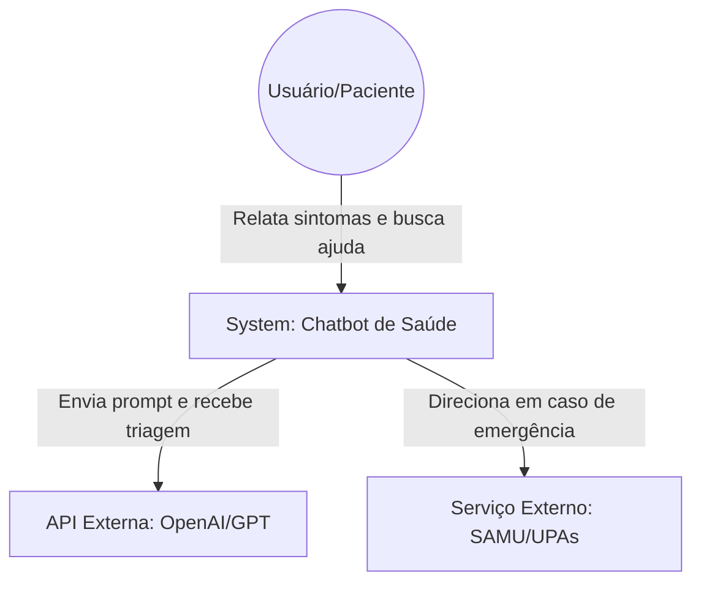
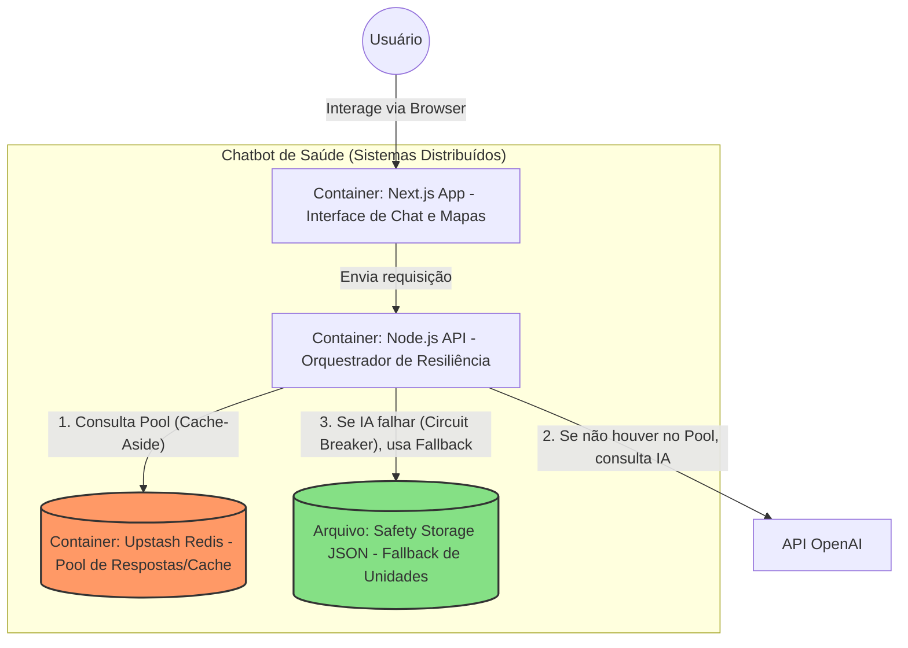

## Nível 1: Diagrama de Contexto

```mermaid
graph TD
    User((Usuário/Paciente))
    System[System: Chatbot de Saúde]
    OpenAI[API Externa: OpenAI/GPT]
    SAMU[Serviço Externo: SAMU/UPAs]

    User -- "Relata sintomas e busca ajuda" --> System
    System -- "Envia prompt e recebe triagem" --> OpenAI
    System -- "Direciona em caso de emergência" --> SAMU
```

## Nível 2: Diagrama de Containers

```mermaid
graph TB
    subgraph "Chatbot de Saúde (Sistemas Distribuídos)"
        WebApp[Container: Next.js App - Interface de Chat e Mapas]
        Backend[Container: Node.js API - Orquestrador de Resiliência]
        Redis[(Container: Upstash Redis - Pool de Respostas/Cache)]
        StaticDB[(Arquivo: Safety Storage JSON - Fallback de Unidades)]
    end

    User((Usuário)) -- "Interage via Browser" --> WebApp
    WebApp -- "Envia requisição" --> Backend

    Backend -- "1. Consulta Pool (Cache-Aside)" --> Redis
    Backend -- "2. Se não houver no Pool, consulta IA" --> OpenAI[API OpenAI]
    Backend -- "3. Se IA falhar (Circuit Breaker), usa Fallback" --> StaticDB

    style Redis fill:#f96,stroke:#333,stroke-width:2px
    style StaticDB fill:#85e085,stroke:#333,stroke-width:2px
```
