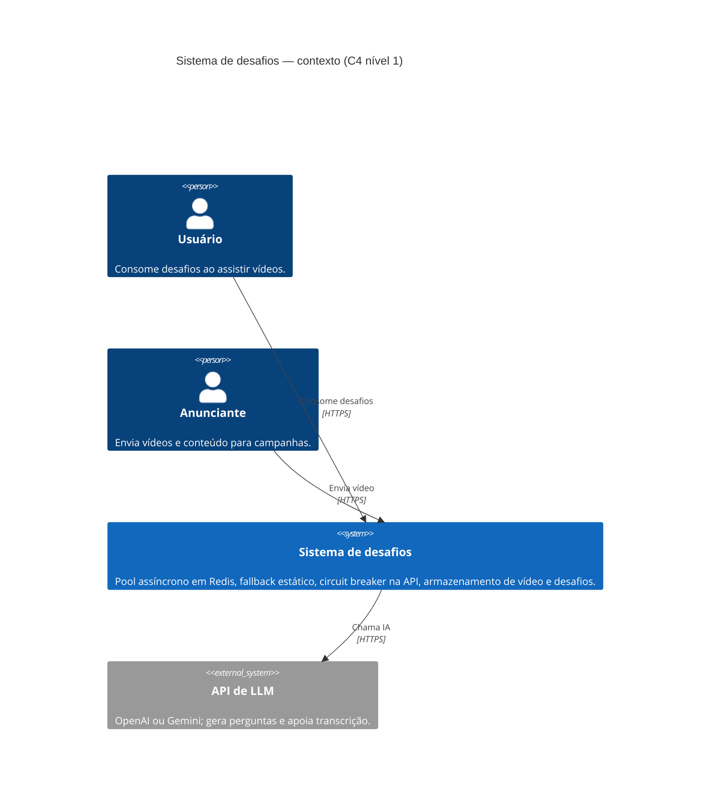
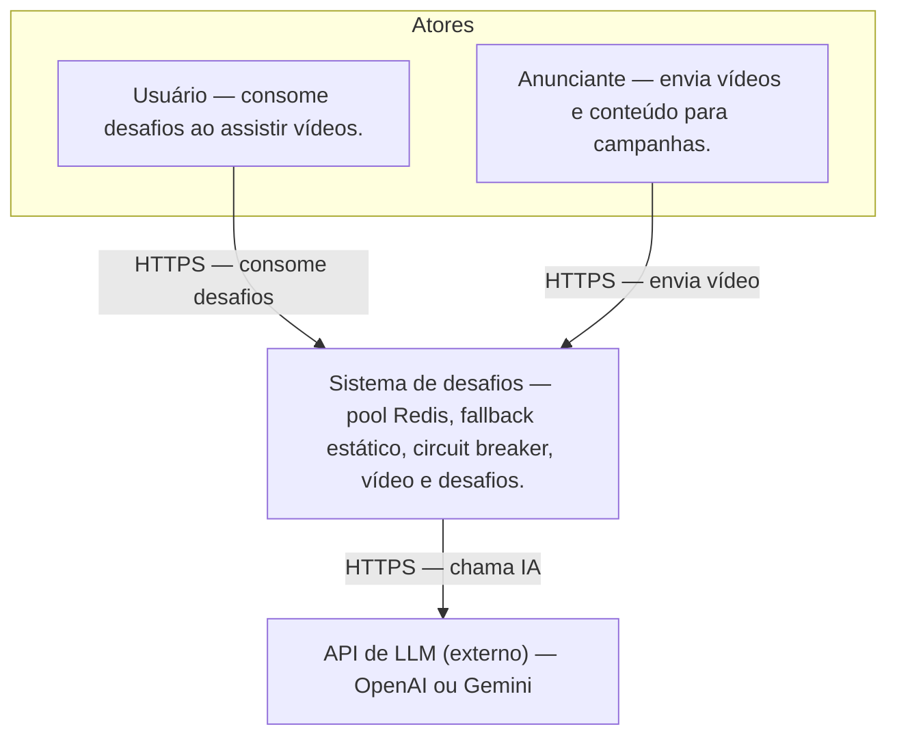

## Diagramas C4 Nível 1 — Contexto

Disposição: **duas pessoas na mesma linha** e **sistema + LLM na linha de baixo**, para as setas não se cruzarem tanto no diagrama gerado.

Se o teu renderizador **ignorar** `UpdateLayoutConfig` (acontece nalgumas versões do Mermaid), usa a variante em *flowchart* abaixo — mesmo conteúdo C4 nível 1, com layout fixo em T.

