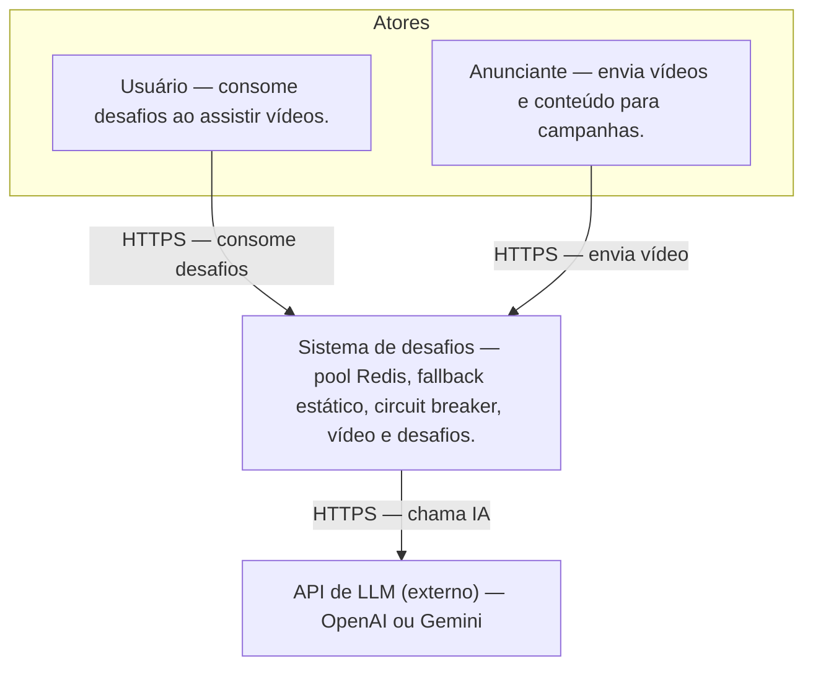

## Diagramas C4 Nível 1 — Contexto

Layout em T: **atores na mesma linha**, **sistema e LLM abaixo**, setas mais legíveis.

```mermaid
flowchart TB
  subgraph atores [Atores]
    direction LR
    jogador["Usuário — consome desafios ao assistir vídeos."]
    anunciante["Anunciante — envia vídeos e conteúdo para campanhas."]
  end
  core["Sistema de desafios — pool Redis, fallback estático, circuit breaker, vídeo e desafios."]
  llm["API de LLM (externo) — OpenAI ou Gemini"]
  jogador -->|"HTTPS — consome desafios"| core
  anunciante -->|"HTTPS — envia vídeo"| core
  core -->|"HTTPS — chama IA"| llm
```
