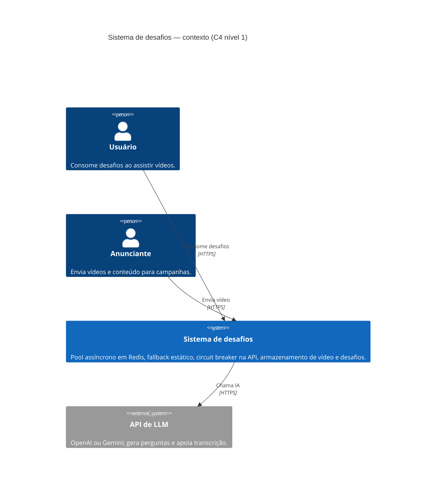

## Diagramas C4 Nível 1 — Contexto


```mermaid
C4Context
title Sistema de desafios — contexto (C4 nível 1)

Person(jogador, "Usuário", "Consome desafios ao assistir vídeos.")
Person(anunciante, "Anunciante", "Envia vídeos e conteúdo para campanhas.")
System(core, "Sistema de desafios", "Pool assíncrono em Redis, fallback estático, circuit breaker na API, armazenamento de vídeo e desafios.")
System_Ext(llm, "API de LLM", "OpenAI ou Gemini; gera perguntas e apoia transcrição.")

Rel(jogador, core, "Consome desafios", "HTTPS")
Rel(anunciante, core, "Envia vídeo", "HTTPS")
Rel(core, llm, "Chama IA", "HTTPS")
```

```
