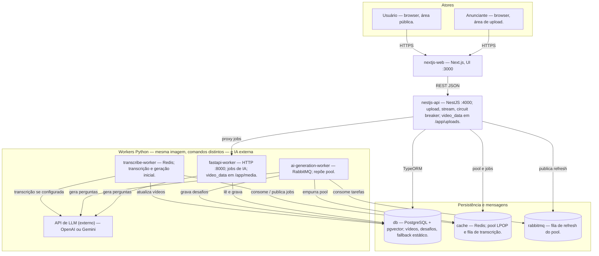

## Diagramas C4 Nível 2 — Containers

Mesmo modelo que o nível 1: **flowchart TB**, atores em linha, camadas por baixo (front → API → workers → dados), **LLM** ao lado dos workers para reduzir cruzamento de setas.

