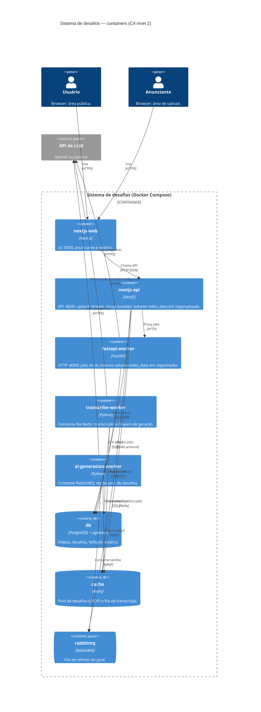

## Diagramas C4 Nível 2 — Containers

```mermaid
C4Container
title Sistema de desafios — containers (C4 nível 2)

Person(jogador, "Usuário", "Browser; área pública.")
Person(anunciante, "Anunciante", "Browser; área de upload.")
System_Ext(llm, "API de LLM", "OpenAI ou Gemini.")

Container_Boundary(sistema, "Sistema de desafios (Docker Compose)") {
  Container(next, "nextjs-web", "Next.js", "UI :3000; anunciante e público.")
  Container(nest, "nestjs-api", "NestJS", "API :4000; upload, stream, circuit breaker; volume video_data em /app/uploads.")
  Container(fastapi, "fastapi-worker", "FastAPI", "HTTP :8000; jobs de IA; mesmo volume video_data em /app/media.")
  Container(transcribe, "transcribe-worker", "Python", "Consome fila Redis; transcrição e disparo de geração.")
  Container(aigen, "ai-generation-worker", "Python", "Consome RabbitMQ; repõe pool de desafios.")
  ContainerDb(pg, "db", "PostgreSQL + pgvector", "Vídeos, desafios, fallback estático.")
  ContainerDb(redis, "cache", "Redis", "Pool de desafios (LPOP) e fila de transcrição.")
  ContainerQueue(rmq, "rabbitmq", "RabbitMQ", "Fila de refresh do pool.")
}

Rel(jogador, next, "Usa", "HTTPS")
Rel(anunciante, next, "Usa", "HTTPS")
Rel(next, nest, "Chama API", "HTTP JSON")
Rel(nest, pg, "Persistência", "TypeORM")
Rel(nest, redis, "Pool e jobs", "Redis protocol")
Rel(nest, rmq, "Publica refresh", "AMQP")
Rel(nest, fastapi, "Proxy jobs", "HTTP")
Rel(transcribe, redis, "Consome / publica jobs", "Redis")
Rel(transcribe, pg, "Atualiza vídeos", "SQL")
Rel(transcribe, llm, "Transcrição quando configurada", "HTTPS")
Rel(aigen, rmq, "Consome tarefas", "AMQP")
Rel(aigen, llm, "Gera perguntas", "HTTPS")
Rel(aigen, pg, "Grava desafios", "SQL")
Rel(aigen, redis, "Empurra pool", "Redis")
Rel(fastapi, llm, "Gera perguntas", "HTTPS")
Rel(fastapi, pg, "Lê e grava", "SQL")
```
