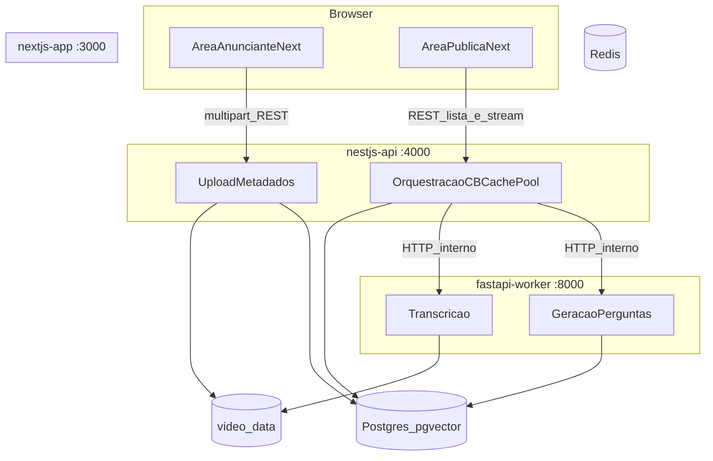

# Implementação local: Next.js, NestJS, FastAPI e Docker

Este documento descreve **o que foi construído** no repositório para a POC de ambiente (docker-compose), alinhado ao plano de arquitetura com **duas áreas no Next**, **API principal no Nest**, **worker em FastAPI**, volume compartilhado para `.mp4` e **streaming do vídeo pela API**.

O [README principal](../README.md) na raiz continua sendo a visão da disciplina, equipe e ADRs em nível de produto.

---

## O que foi feito

### Contêineres e portas

| Serviço | Pasta | Porta | Função |
|--------|--------|-------|--------|
| `nextjs-web` | `nextjs-app/` | 3000 | Interface: área **anunciante** (`/advertiser`) e **pública** (`/public`); chama a API Nest no browser (`NEXT_PUBLIC_API_URL`) e, no servidor, usa `INTERNAL_API_URL` para listar vídeos. |
| `nestjs-api` | `nestjs-api/` | 4000 | API principal: upload multipart, **persistência em Postgres via TypeORM**, gravação no volume `video_data`, **stream HTTP** com suporte a `Range` (206), proxy de desafios ao worker. |
| `fastapi-worker` | `python-worker/` | 8000 | Worker IA: transcrição (stub), **geração real de perguntas via Gemini/OpenAI**, **geração de embeddings** e **persistência no pgvector**. |
| `db` | — | 5432 | PostgreSQL com **pgvector** — schema com tabelas `videos`, `challenges` (pool IA) e `static_fallback_questions` (fallback). |
| `cache` | — | 6379 | Redis (preparado para cache-aside — ainda não integrado). |

### Persistência Postgres

O schema é criado automaticamente pelo `init.sql` na primeira subida do container:

| Tabela | Função |
|--------|--------|
| `videos` | Metadados dos vídeos: nome, caminho, `transcript`, `scene_description` |
| `challenges` | Pool de desafios gerados pela IA, com embeddings vetoriais (`vector`) para busca por similaridade |
| `static_fallback_questions` | 8 perguntas genéricas pré-populadas para uso como fallback quando a IA estiver indisponível |

- **NestJS** usa TypeORM com entidades `Video`, `Challenge` e `StaticFallbackQuestion`
- `VideosService` persiste via `Repository<Video>` (substituiu o `Map` em memória)
- Volume `pgdata` garante que dados sobrevivem a restarts

### Geração de Desafios por IA

O worker suporta **dois providers**, controlados pela variável `AI_PROVIDER`:

| Provider | Modelo padrão | Embedding | Dimensões |
|----------|--------------|-----------|-----------|
| `gemini` | `gemini-2.5-flash` | `gemini-embedding-001` | 3072 |
| `openai` | `gpt-4o-mini` | `text-embedding-ada-002` | 1536 |

Fluxo do endpoint `/jobs/questions`:
1. Lê `transcript` e `scene_description` do vídeo no Postgres
2. Monta prompt e chama o LLM para gerar perguntas de múltipla escolha
3. Gera embeddings para cada pergunta
4. Persiste tudo na tabela `challenges` com vetores pgvector

### Volume compartilhado

- Nome: **`video_data`**.
- **Nest:** montado em `/app/uploads` — escrita no upload e leitura para **`GET /videos/:id/stream`**.
- **Worker:** montado em `/app/media` — mesmo conteúdo; Nest e worker usam o **mesmo arquivo** por caminho relativo (`uuid.mp4`).

O **Next não monta** o volume de vídeos; o browser consome o stream via URL pública da Nest.

### Fluxos implementados

1. **Anunciante:** formulário em `/advertiser` envia `POST /videos/upload` (multipart) para a Nest; arquivo salvo no volume e metadados persistidos no Postgres; Nest chama o worker para transcrição (stub).
2. **Público:** `/public` lista `GET /videos` (SSR usando `INTERNAL_API_URL`). Cada item usa `<video src=...>` apontando para o stream da Nest. No **play**, o cliente chama `POST /videos/:id/challenges`, que repassa ao worker para gerar perguntas reais via IA; o resultado é exibido em **cards interativos** com opções clicáveis, feedback de acerto/erro e navegação entre perguntas.

### Endpoints Nest (resumo)

- `GET /health`
- `POST /videos/upload` — campo `file`
- `GET /videos` — lista metadados do Postgres
- `GET /videos/:id/stream` — `video/mp4`, `Accept-Ranges`, **206** quando há `Range`
- `POST /videos/:id/challenges` — proxy ao worker

### Endpoints FastAPI (prefixo `/api/v1`)

- `GET /health`
- `POST /jobs/transcribe` — body: `video_id`, `relative_path` (stub)
- `POST /jobs/questions` — body: `video_id`, `relative_path`, `count` — **gera perguntas via IA e salva no banco**

---

## Diagrama do plano (containers e fluxos)



---

## Estrutura de pastas relevante

```
nextjs-app/
  app/(advertiser)/advertiser/   # upload
  app/(public)/public/           # lista + player
  components/                    # AdvertiserUpload, PublicVideoGallery, ChallengeCard, SiteHeader
  lib/api.ts                     # publicApiUrl / serverApiUrl
nestjs-api/
  init.sql                       # schema Postgres + seed fallback
  src/database/                  # DatabaseModule + entidades TypeORM
  src/videos/                    # upload, stream Range, challenges
  src/health/
python-worker/
  app/main.py
  app/api/routes/                # health, jobs
  app/services/                  # ai_service (Gemini/OpenAI), db_client (Postgres)
  app/core/config.py             # MEDIA_ROOT, AI_PROVIDER, API keys, DATABASE_URL
```

---

## Como subir o ambiente

1. Crie um arquivo `.env` na raiz com suas chaves:

```env
AI_PROVIDER=gemini
GEMINI_API_KEY=sua-chave
# ou para OpenAI:
# AI_PROVIDER=openai
# OPENAI_API_KEY=sua-chave
```

2. Na raiz do repositório:

```bash
docker compose up --build -d
```

3. Acesse `http://localhost:3000`

---

## O que falta fazer (Pendências / Próximos Passos)

Em alinhamento com a separação de papéis descrita no [README.md principal](../README.md), os seguintes pontos ainda precisam ser implementados:

### 1. Mensageria Assíncrona (RabbitMQ)
- **Status:** Pendente.
- **Responsável:** Middleware Eng.
- **Descrição:** Atualmente o NestJS recruta o worker via chamada HTTP assíncrona (`fetch`). A arquitetura final prevê que o NestJS publique eventos em tópicos do RabbitMQ e o FastAPI atue como um *consumer* dessa fila, garantindo resiliência em caso de picos de acessos sem sobrecarregar a rede interna com HTTP requests zumbis.

### 2. Busca por Similaridade Vetorial Avançada (pgvector)
- **Status:** Parcial (Embeddings estão sendo salvos).
- **Responsável:** IA / Data Engineer.
- **Descrição:** Hoje, a "Camada 2" do Circuit Breaker busca diretamente no banco por `$videoId`. O objetivo do `pgvector` é permitir buscar desafios *similares* gerados para **outros** vídeos caso o vídeo atual esgote seu pool, utilizando a query: `SELECT ... ORDER BY embedding <=> $1`.

### 3. Testes de Carga e Chaos Engineering (QA / Resiliency)
- **Status:** Pendente.
- **Responsável:** QA / Resiliency.
- **Descrição:** Executar planos de teste (K6, JMeter) com alto volume de requisições simulando usuários assistindo aos vídeos. Simular a queda do container do `python-worker` para validar na prática o Circuit Breaker servindo o Fallback Estático ininterruptamente. Implementar simulações de DoS.

### 4. Cache-Aside Sensível (Transcrições)
- **Status:** Pendente.
- **Responsável:** Data Engineer / Backend.
- **Descrição:** Armazenar no Redis transcrições e metadados que são lidos pelo Worker Python frequentemente para poupar chamadas repetitivas de extração textual no Postgres.

### 5. Padrão Retry e Observabilidade (Backoff Exponencial)
- **Status:** Pendente.
- **Responsável:** DevOps / Backend.
- **Descrição:** Adicionar biblioteca robusta (ex: `@nestjs/bull` ou puro RxJS) para tentar reacessar serviços (banco, redis ou APIs pagas Gemini/OpenAI) caso tomem timeout, utilizando *backoff exponencial*.

### 6. Transcrição de Áudio Real (Whisper)
- **Status:** Stub (Mocado).
- **Responsável:** IA Engineer.
- **Descrição:** Substituir a geração de transcrição fixa no Python por extração via FFMPEG acoplada ao pipeline do Whisper API/Local.
