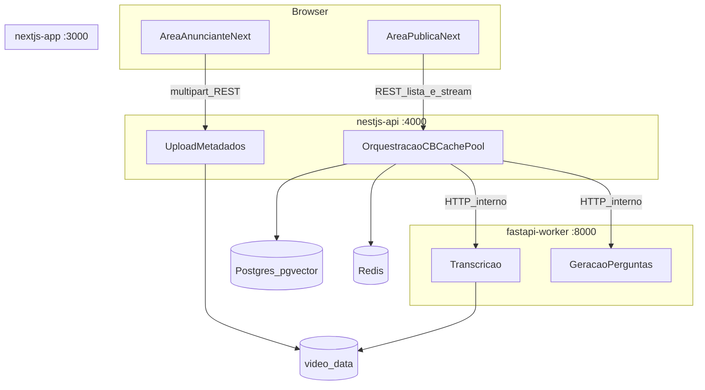

# Implementação local: Next.js, NestJS, FastAPI e Docker

Este documento descreve **o que foi construído** no repositório para a POC de ambiente (docker-compose), alinhado ao plano de arquitetura com **duas áreas no Next**, **API principal no Nest**, **worker em FastAPI**, volume compartilhado para `.mp4` e **streaming do vídeo pela API**.

O [README principal](../README.md) na raiz continua sendo a visão da disciplina, equipe e ADRs em nível de produto.

---

## O que foi feito

### Contêineres e portas

| Serviço | Pasta | Porta | Função |
|--------|--------|-------|--------|
| `nextjs-web` | `nextjs-app/` | 3000 | Interface: área **anunciante** (`/advertiser`) e **pública** (`/public`); chama a API Nest no browser (`NEXT_PUBLIC_API_URL`) e, no servidor, usa `INTERNAL_API_URL` para listar vídeos. |
| `nestjs-api` | `nestjs-api/` | 4000 | API principal: upload multipart, persistência em memória (POC), **gravação no volume** `video_data`, **stream HTTP** com suporte a `Range` (206), disparo ao worker para transcrição e perguntas. |
| `fastapi-worker` | `python-worker/` | 8000 | Worker: health, stubs `POST /api/v1/jobs/transcribe` e `POST /api/v1/jobs/questions`. |
| `db` | — | 5432 | PostgreSQL com imagem **pgvector** (preparado para o pool; esquema aplicado em etapas futuras). |
| `cache` | — | 6379 | Redis (preparado para cache-aside). |

### Volume compartilhado

- Nome: **`video_data`**.
- **Nest:** montado em `/app/uploads` — escrita no upload e leitura para **`GET /videos/:id/stream`**.
- **Worker:** montado em `/app/media` — mesmo conteúdo na raiz do volume; o Nest e o worker usam o **mesmo arquivo** referenciado por caminho relativo (ex.: `uuid.mp4`).

O **Next não monta** o volume de vídeos; o browser só consome o stream via URL pública da Nest.

### Fluxos implementados

1. **Anunciante:** formulário em `/advertiser` envia `POST /videos/upload` (multipart) para a Nest; arquivo salvo no volume; Nest chama o worker para transcrição (stub) e pode atualizar transcript em memória.
2. **Público:** `/public` lista `GET /videos` (SSR usando `INTERNAL_API_URL` dentro do compose). Cada item usa `<video src={NEXT_PUBLIC_API_URL + '/videos/' + id + '/stream'}>`. No **play**, o cliente chama `POST /videos/:id/challenges`, que repassa ao worker (stub de perguntas).

### Endpoints Nest (resumo)

- `GET /health`
- `POST /videos/upload` — campo `file`
- `GET /videos` — lista metadados
- `GET /videos/:id/stream` — `video/mp4`, `Accept-Ranges`, **206** quando há `Range`
- `POST /videos/:id/challenges` — proxy lógico ao worker

### Endpoints FastAPI (prefixo `/api/v1`)

- `GET /health`
- `POST /jobs/transcribe` — body: `video_id`, `relative_path`
- `POST /jobs/questions` — body: `video_id`, `relative_path`

---

## Diagrama do plano (containers e fluxos)

O diagrama abaixo corresponde ao plano de arquitetura: Next com duas experiências, Nest como orquestração e persistência planejada, worker para IA pesada, volume de mídia, Postgres e Redis.



Na implementação atual, a **lista e o stream** para o público passam pela Nest (`Orch`): o browser obtém bytes do vídeo em `GET /videos/:id/stream`, não pelo Next estático.

---

## Estrutura de pastas relevante

```
nextjs-app/
  app/(advertiser)/advertiser/   # upload
  app/(public)/public/           # lista + player
  components/                    # upload, galeria, header
  lib/api.ts                     # publicApiUrl / serverApiUrl
nestjs-api/
  src/videos/                    # upload, stream Range, challenges
  src/health/
python-worker/
  app/main.py
  app/api/routes/                # health, jobs
  app/core/config.py             # MEDIA_ROOT
```

---

## Como subir o ambiente

Na raiz do repositório (onde está `docker-compose.yml`):

```bash
docker compose up --build
```

Variáveis úteis: `OPENAI_API_KEY` no `.env` na raiz (para o worker, quando integrar modelo real). Para o browser acessar a API a partir da máquina host, `NEXT_PUBLIC_API_URL=http://localhost:4000` já está definido no compose para o serviço Next.

---

## Próximos passos (fora deste escopo de setup)

- Persistência real em Postgres (metadados, transcript, embeddings pgvector).
- Cache-aside em Redis e **circuit breaker** + fallback estático, conforme ADRs do README principal.
- Whisper/ffmpeg no worker e fila assíncrona, se a equipe optar por desacoplar ainda mais o processamento pesado.
