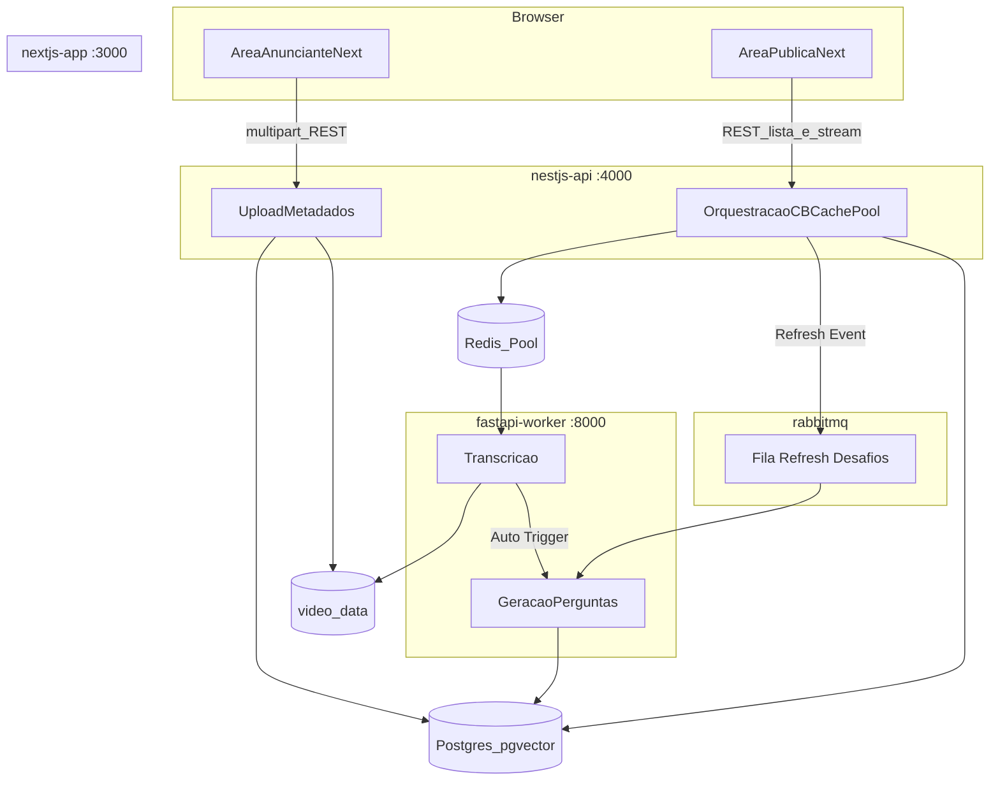

# Implementação local: Next.js, NestJS, FastAPI e Docker

Este documento descreve **o que foi construído** no repositório para a POC de ambiente (docker-compose), alinhado ao plano de arquitetura com **duas áreas no Next**, **API principal no Nest**, **worker em FastAPI**, volume compartilhado para `.mp4` e **streaming do vídeo pela API**.

O [README principal](../README.md) na raiz continua sendo a visão da disciplina, equipe e ADRs em nível de produto.

---

## O que foi feito

### Contêineres e portas

| Serviço | Pasta | Porta | Função |
|--------|--------|-------|--------|
| `nextjs-web` | `nextjs-app/` | 3000 | Interface: área **anunciante** (`/advertiser`) e **pública** (`/public`); chama a API Nest no browser (`NEXT_PUBLIC_API_URL`) e, no servidor, usa `INTERNAL_API_URL` para listar vídeos. |
| `nestjs-api` | `nestjs-api/` | 4000 | API principal: upload multipart, **persistência em Postgres via TypeORM**, gravação no volume `video_data`, **stream HTTP** com suporte a `Range` (206), proxy de desafios ao worker. |
| `fastapi-worker` | `python-worker/` | 8000 | API HTTP: **geração de perguntas** (Gemini/OpenAI), embeddings e persistência em `challenges`. |
| `transcribe-worker` | `python-worker/` | — | **Consumidor Redis**: lê jobs `transcribe:jobs` e roda transcrição. Aciona a geração inicial de perguntas em background. |
| `ai-generation-worker`| `python-worker/` | — | **Consumidor RabbitMQ**: lê pedidos de refresh de pool e gera blocos de 5 novas perguntas. |
| `db` | — | 5432 | PostgreSQL com **pgvector** — schema com tabelas `videos`, `challenges` e `static_fallback_questions`. |
| `cache` | — | 6379 | **Redis:** Fila de transcrição e **Pool de Desafios** (armazenamento temporário para consumo rápido). |
| `rabbitmq`| — | 5672 | **RabbitMQ:** Broker de mensagens para tarefas assíncronas de manutenção do pool de IA. |

### Persistência Postgres

O schema é criado automaticamente pelo `init.sql` na primeira subida do container:

| Tabela | Função |
|--------|--------|
| `videos` | Metadados dos vídeos: nome, caminho, `transcript`, `scene_description` |
| `challenges` | Pool de desafios gerados pela IA, com embeddings vetoriais (`vector`) para busca por similaridade |
| `static_fallback_questions` | 8 perguntas genéricas pré-populadas para uso como fallback quando a IA estiver indisponível |

- **NestJS** usa TypeORM com entidades `Video`, `Challenge` e `StaticFallbackQuestion`
- `VideosService` persiste via `Repository<Video>` (substituiu o `Map` em memória)
- Volume `pgdata` garante que dados sobrevivem a restarts

### Geração de Desafios por IA

O worker suporta **dois providers**, controlados pela variável `AI_PROVIDER`:

| Provider | Modelo padrão | Embedding | Dimensões |
|----------|--------------|-----------|-----------|
| `gemini` | `gemini-2.5-flash` | `gemini-embedding-001` | 3072 |
| `openai` | `gpt-4o-mini` | `text-embedding-ada-002` | 1536 |

Fluxo de Geração (Híbrido):
1. **Pós-Upload**: O `transcribe-worker` dispara a geração inicial de 5 perguntas assim que termina a transcrição.
2. **Consumo via Pool**: A NestJS retira as perguntas do Redis (`LPOP`).
3. **Auto-Refresh**: Quando o pool atinge o limite de **2 perguntas**, a API dispara um evento via **RabbitMQ** para o `ai-generation-worker` repovoar o banco com mais 5 perguntas.

### Volume compartilhado

- Nome: **`video_data`**.
- **Nest:** montado em `/app/uploads` — escrita no upload e leitura para **`GET /videos/:id/stream`**.
- **Worker:** montado em `/app/media` — mesmo conteúdo; Nest e worker usam o **mesmo arquivo** por caminho relativo (`uuid.mp4`).

O **Next não monta** o volume de vídeos; o browser consome o stream via URL pública da Nest.

### Fluxos implementados

1. **Anunciante:** formulário em `/advertiser` envia `POST /videos/upload` (multipart); arquivo salvo e job para transcrição criado no Redis. O `transcribe-worker` processa o áudio, salva o `transcript` e **inicia automaticamente a primeira geração de desafios** via IA.
2. **Público:** `/public` lista vídeos. No **play**, o cliente chama `POST /videos/:id/challenges`, que usa o **Circuit Breaker**:
   - **Camada 1 (Pool/Fast)**: Tenta tirar do Redis (Pool). Se o pool baixar de 2 itens, aciona o RabbitMQ em background.
   - **Camada 2 (DB/Vector)**: Se o Redis estiver vazio, busca do Postgres as perguntas geradas no upload.
   - **Camada 3 (Fallback)**: Se nada existir, usa perguntas estáticas genéricas.

### Endpoints Nest (resumo)

- `GET /health`
- `POST /videos/upload` — campo `file`
- `GET /videos` — lista metadados do Postgres
- `GET /videos/:id/stream` — `video/mp4`, `Accept-Ranges`, **206** quando há `Range`
- `POST /videos/:id/challenges` — circuit breaker (pool → DB → estático); regista **`challenge_delivery_events`**
- `GET /stats/videos` — agregado para a página **Estatísticas** (transcript, logs, entregas, auditoria IA)

### Migração de base já existente

O **`docker build` da Nest não altera o Postgres** (não há base de dados nessa fase). Em cada **arranque** da API (`npm run start:dev`, `docker compose up`), a Nest aplica automaticamente o ficheiro idempotente [`nestjs-api/migrations/02-stats.sql`](nestjs-api/migrations/02-stats.sql) logo após ligar ao Postgres (`dataSourceFactory`), criando colunas/tabelas em falta (ex.: `videos.transcript_mode`).

Se quiseres aplicar só pela shell (opcional), com o Compose a correr:

```bash
docker compose exec db psql -U user -d db -f /migrations/02-stats.sql
```

Bases novas criadas a partir do `init.sql` atual já incluem estas estruturas; a migração automática é redundante mas segura.

### Endpoints FastAPI (prefixo `/api/v1`)

- `GET /health`
- `POST /jobs/transcribe` — body: `video_id`, `relative_path` — mesmo pipeline de transcrição + `UPDATE` em `videos` (testes manuais)
- `POST /jobs/questions` — body: `video_id`, `relative_path`, `count` — **gera perguntas via IA e salva no banco**

---

## Diagrama do plano (containers e fluxos)



*(Fluxo de upload: `Upload` grava arquivo e publica job em **Redis**; o processo de transcrição roda no container **transcribe-worker**, não mais via HTTP síncrono do Nest para o `/jobs/transcribe`.)*

---

## Estrutura de pastas relevante

```
nextjs-app/
  app/(advertiser)/advertiser/   # upload
  app/(public)/public/           # lista + player
  components/                    # AdvertiserUpload, PublicVideoGallery, ChallengeCard, SiteHeader
  lib/api.ts                     # publicApiUrl / serverApiUrl
nestjs-api/
  init.sql                       # schema Postgres + seed fallback
  src/database/                  # DatabaseModule + entidades TypeORM
  src/videos/                    # upload, stream Range, challenges
  src/health/
python-worker/
  app/main.py
  app/api/routes/                # health, jobs
  app/services/                  # ai_service, db_client, transcribe_pipeline
  app/worker/transcribe_consumer.py
  app/core/config.py             # MEDIA_ROOT, REDIS_URL, TRANSCRIBE_MODE, etc.
```

---

## Como obter API keys (Gemini e OpenAI)

- **Google Gemini:** acesse [Google AI Studio](https://aistudio.google.com/apikey), faça login com a conta Google do projeto e clique em **Create API key** (ou use uma chave de projeto no Google Cloud com a API Generative Language habilitada). Guarde o valor — ele começa tipicamente por `AIza...`.

- **OpenAI:** acesse [platform.openai.com](https://platform.openai.com/), crie conta / faça login, vá em **API keys** e **Create new secret key**. É preciso ter créditos ou plano que permita uso da API. A chave costuma começar por `sk-...`.

Nunca commite chaves no Git. Os arquivos `.env` e `.env.local` estão no [`.gitignore`](../.gitignore).

---

## Arquivos `.env`, `.env.local` e Docker Compose

O **Docker Compose** substitui variáveis como `${GEMINI_API_KEY}` lendo **por omissão** o ficheiro **`.env`** na mesma pasta que o `docker-compose.yml`.

- **Opção A (mais simples):** copie [`.env.example`](../.env.example) para **`.env`**, preencha as chaves e execute `docker compose up --build`.

- **Opção B (preferir o nome `.env.local`):** copie o exemplo para **`.env.local`** e suba o stack indicando esse ficheiro (o Compose **não** carrega `.env.local` automaticamente):

```bash
docker compose --env-file .env.local up --build -d
```

Assim as mesmas variáveis do exemplo entram na interpolação `${...}` e nos contentores `fastapi-worker` e `transcribe-worker`.

*(O Next.js em desenvolvimento local usa por vezes `.env.local` só para o front; aqui o foco é o Compose na raiz do repositório.)*

---

## Como subir o ambiente

1. Copie o modelo [`.env.example`](../.env.example) para `.env` ou `.env.local` e preencha as chaves.

2. Na raiz do repositório:

```bash
docker compose up --build -d
```

Se usou **`.env.local`** em vez de **`.env`**, use:

```bash
docker compose --env-file .env.local up --build -d
```

3. Acesse `http://localhost:3000`

---

## O que falta fazer (Pendências / Próximos Passos)

Em alinhamento com a separação de papéis descrita no [README.md principal](../README.md), os seguintes pontos ainda precisam ser implementados:

### 1. Mensageria Assíncrona (RabbitMQ ou evolução da fila Redis)
- **Status:** **Implementado** via RabbitMQ.
- **Descrição:** Fila `challenge_generation` orquestra o refresh automático do pool de perguntas, garantindo que o tempo de resposta para o usuário seja instantâneo (visto que a IA trabalha em background).

### 2. Busca por Similaridade Vetorial Avançada (pgvector)
- **Status:** Parcial (Embeddings estão sendo salvos).
- **Responsável:** IA / Data Engineer.
- **Descrição:** Hoje, a "Camada 2" do Circuit Breaker busca diretamente no banco por `$videoId`. O objetivo do `pgvector` é permitir buscar desafios *similares* gerados para **outros** vídeos caso o vídeo atual esgote seu pool, utilizando a query: `SELECT ... ORDER BY embedding <=> $1`.

### 3. Testes de Carga e Chaos Engineering (QA / Resiliency)
- **Status:** Pendente.
- **Responsável:** QA / Resiliency.
- **Descrição:** Executar planos de teste (K6, JMeter) com alto volume de requisições simulando usuários assistindo aos vídeos. Simular a queda do container do `python-worker` para validar na prática o Circuit Breaker servindo o Fallback Estático ininterruptamente. Implementar simulações de DoS.

### 4. Cache-Aside Sensível (Transcrições)
- **Status:** Pendente.
- **Responsável:** Data Engineer / Backend.
- **Descrição:** Armazenar no Redis transcrições e metadados que são lidos pelo Worker Python frequentemente para poupar chamadas repetitivas de extração textual no Postgres.

### 5. Padrão Retry e Observabilidade (Backoff Exponencial)
- **Status:** **Implementado** (RabbitMQ e Python Worker).
- **Descrição:** Implementado loop de retry robusto na conexão dos workers com o RabbitMQ e healthcheck no Docker Compose para sincronizar o startup.

### 6. Transcrição de Áudio (Gemini / Whisper local / OpenAI)
- **Status:** Implementado com **ffmpeg** + **`TRANSCRIBE_MODE`**: `stub`, `gemini` (multimodal + `GEMINI_API_KEY`; opcional `TRANSCRIBE_GEMINI_MODEL`), `local` (**faster-whisper**), `api` (OpenAI `whisper-1`). Em erro, **fallback stub** + log `fallback_stub`.
- **Descrição:** Ajustar `WHISPER_*` para local; quotas OpenAI/Gemini podem forçar fallback visível em Estatísticas.
